

  <a href="assets/banner.svg" target="_blank" rel="noopener noreferrer">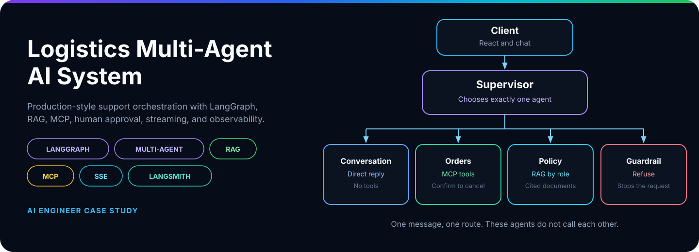</a>

<h1 align="center">LogiFlow</h1>

  <strong>A production-style multi-agent logistics support system</strong>

  
  
  
  

  
  
  
  

<table align="center" style="margin-left:auto;margin-right:auto">
  <tr>
    <td align="center"><a href="#overview"><b>📋 Overview</b></a></td>
    <td align="center"><a href="#key-capabilities"><b>⚡ Capabilities</b></a></td>
    <td align="center"><a href="#system-architecture"><b>🏗️ Architecture</b></a></td>
    <td align="center"><a href="#multi-agent-architecture"><b>🤖 Agents</b></a></td>
    <td align="center"><a href="#how-a-request-flows"><b>🔄 Flow</b></a></td>
  </tr>
  <tr>
    <td align="center"><a href="#orders-workflow"><b>📦 Orders</b></a></td>
    <td align="center"><a href="#mcp-integration"><b>🔧 MCP</b></a></td>
    <td align="center"><a href="#rag-pipeline"><b>📚 RAG</b></a></td>
    <td align="center"><a href="#human-in-the-loop-workflow"><b>✅ Approval</b></a></td>
    <td align="center"><a href="#real-time-sse-streaming"><b>📡 Streaming</b></a></td>
  </tr>
  <tr>
    <td align="center"><a href="#observability-with-langsmith"><b>📈 LangSmith</b></a></td>
    <td align="center"><a href="#use-cases"><b>🎯 Use cases</b></a></td>
    <td align="center"><a href="#technology-stack"><b>🧰 Stack</b></a></td>
  </tr>
</table>

## 📋 Overview

LogiFlow is a logistics support assistant for customers and employees. One conversation covers tracking, delivery dates, cancellation, and policy.

> A status check, a policy question, and a cancellation are not the same job. The supervisor sends each message down one path.

<table align="center" style="margin-left:auto;margin-right:auto">
  <tr>
    <td width="33%" valign="top">
      <strong>📦 Live orders</strong>  
      “Where is my order?” needs that customer’s record. The orders agent reads it from the logistics server. It does not guess a status.
    </td>
    <td width="33%" valign="top">
      <strong>📄 Trusted policy</strong>  
      “What is your cancellation policy?” needs an indexed document. The policy agent answers from that text and names the source.
    </td>
    <td width="33%" valign="top">
      <strong>✅ Confirmed writes</strong>  
      “Cancel this order” changes state. Eligibility runs first. Nothing is written until the person confirms.
    </td>
  </tr>
</table>

<table align="center" style="margin-left:auto;margin-right:auto">
  <tr>
    <td width="25%" valign="top">
      <strong>🧭 Supervisor</strong>  
      Chooses the agent, the intent, and any missing order ID. It does not answer, call a tool, or open a document.
    </td>
    <td width="25%" valign="top">
      <strong>🚚 Orders</strong>  
      Status, delivery, and the customer’s own list run immediately. Cancel pauses for approval.
    </td>
    <td width="25%" valign="top">
      <strong>📚 Policy</strong>  
      Customer and employee documents stay apart. A customer never receives employee policy.
    </td>
    <td width="25%" valign="top">
      <strong>🛡️ Guardrail</strong>  
      Unrelated requests, and employee policy asked by a customer, stop here.
    </td>
  </tr>
</table>

Replies stream over SSE. LangSmith records the route, the tool call, and the result.

## ⚡ Key capabilities

<table align="center" style="margin-left:auto;margin-right:auto">
  <tr>
    <th>Capability</th>
    <th>What it demonstrates</th>
  </tr>
  <tr>
    <td>🧭 Supervisor routing</td>
    <td>Intent classification before any work starts</td>
  </tr>
  <tr>
    <td>🚚 Orders agent</td>
    <td>Status, delivery estimates, and the customer’s own orders</td>
  </tr>
  <tr>
    <td>✅ Safe cancellation</td>
    <td>Eligibility check, human approval, then an idempotent write</td>
  </tr>
  <tr>
    <td>📚 Policy RAG</td>
    <td>Separate customer and employee knowledge</td>
  </tr>
  <tr>
    <td>🛡️ Guardrails</td>
    <td>Out-of-scope requests and unauthorized employee policy</td>
  </tr>
  <tr>
    <td>🔧 MCP tools</td>
    <td>Operational data behind a tool server, not inside the prompt</td>
  </tr>
  <tr>
    <td>⚡ SSE streaming</td>
    <td>Tokens, tool results, sources, and approval cards as they happen</td>
  </tr>
  <tr>
    <td>📈 LangSmith</td>
    <td>One trace for the graph and the tool boundary</td>
  </tr>
</table>

## 🏗️ System architecture

<a href="assets/diagrams/system-architecture.svg" target="_blank" rel="noopener noreferrer">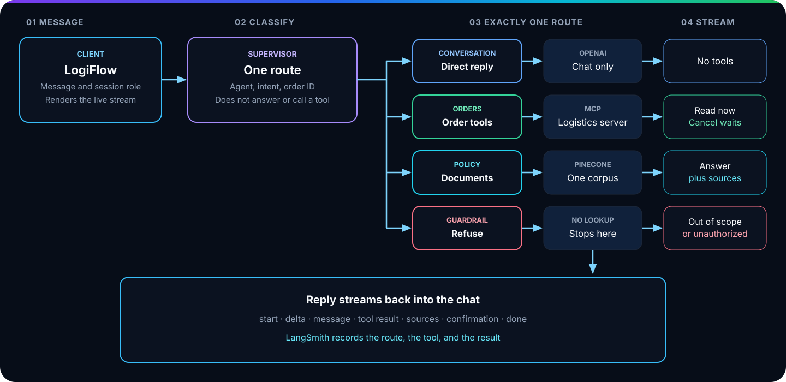</a>

The picture is the request, not a stack diagram. The client streams one message in. The supervisor picks one specialist. Conversation talks to the model. Orders talks to MCP. Policy talks to the indexed documents. The guardrail stops. The reply streams back, and LangSmith keeps the trace.

## 🤖 Multi-agent architecture

<a href="assets/diagrams/multi-agent-workflow.svg" target="_blank" rel="noopener noreferrer">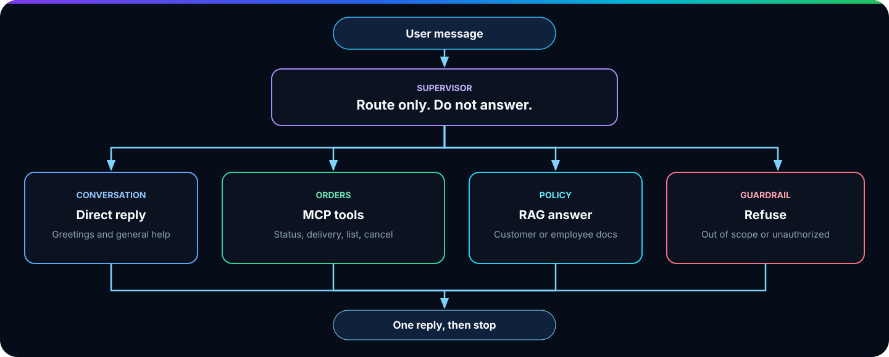</a>

A multi-agent design is used because these requests fail in different ways. Conversation should not see order tools. Policy should not invent operational status. Cancellation should not run as a side effect of a helpful answer.

<table align="center" style="margin-left:auto;margin-right:auto">
  <tr>
    <th>Agent</th>
    <th>Handles</th>
    <th>Does not handle</th>
  </tr>
  <tr>
    <td>💬 Conversation</td>
    <td>Greetings and general logistics help</td>
    <td>Tools and documents</td>
  </tr>
  <tr>
    <td>🚚 Orders</td>
    <td>Status, delivery estimates, order lists, cancellation</td>
    <td>Policy text</td>
  </tr>
  <tr>
    <td>📚 Policy</td>
    <td>Customer and employee policy questions</td>
    <td>Live order state</td>
  </tr>
  <tr>
    <td>🛡️ Guardrail</td>
    <td>Unrelated requests, and employee policy asked by a customer</td>
    <td>Anything it would have to answer</td>
  </tr>
</table>

The supervisor returns an agent, an intent, an optional order ID, missing fields, and a short reason. Customer identity is never taken from the message. It comes from the authenticated user.

## 🔄 How a request flows

1. The client sends the message with the conversation ID.
2. The server attaches the authenticated user and streams the graph.
3. The supervisor routes the turn.
4. The specialist does its job: reply, retrieve, call a tool, or refuse.
5. The client renders tokens, sources, tool data, or an approval card.
6. The stream closes with a terminal status.

If an approval is already waiting, a new message does not start. The user confirms or rejects the pending action first.

### Orders workflow

Order requests stay in this workflow. A read finishes immediately. A write finishes only after approval.

<a href="assets/diagrams/orders-agent.svg" target="_blank" rel="noopener noreferrer">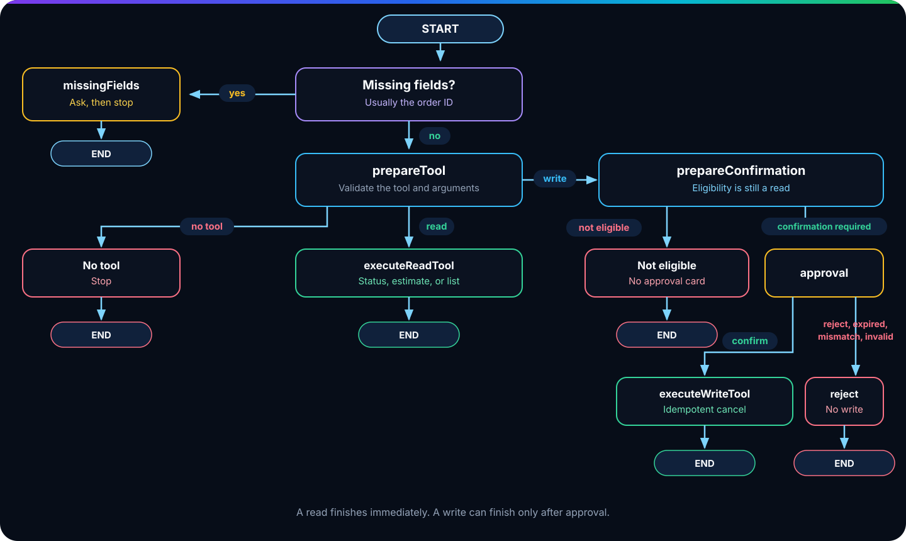</a>

<table align="center" style="margin-left:auto;margin-right:auto">
  <tr>
    <th>Path</th>
    <th>What happens</th>
  </tr>
  <tr>
    <td>Missing fields</td>
    <td>Ask for the order ID and stop</td>
  </tr>
  <tr>
    <td>No tool</td>
    <td>Stop. Nothing is called</td>
  </tr>
  <tr>
    <td>Read</td>
    <td>Validate, call MCP, stop</td>
  </tr>
  <tr>
    <td>Write, not eligible</td>
    <td>Stop. No approval card</td>
  </tr>
  <tr>
    <td>Confirm</td>
    <td>Run the cancel with the action ID</td>
  </tr>
  <tr>
    <td>Reject, expired, mismatch, or invalid</td>
    <td>Clear the action. No write</td>
  </tr>
</table>

## 🔧 MCP integration

<a href="assets/diagrams/mcp-flow.svg" target="_blank" rel="noopener noreferrer">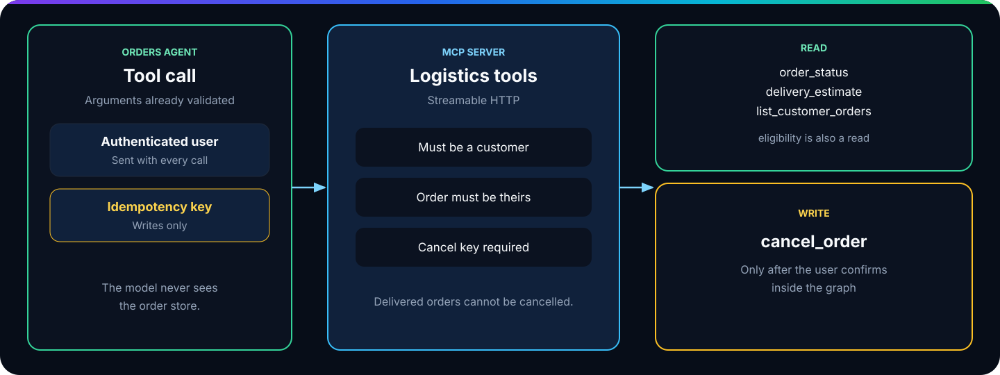</a>

The orders agent never embeds order logic in the model. It calls a logistics MCP server over streamable HTTP. The signed-in user travels with the call. Tools enforce that the caller is a customer and that the order belongs to them.

<table align="center" style="margin-left:auto;margin-right:auto">
  <tr>
    <th>Tool</th>
    <th>Mode</th>
    <th>Used for</th>
  </tr>
  <tr>
    <td><code>order_status</code></td>
    <td>Read</td>
    <td>Current status of an owned order</td>
  </tr>
  <tr>
    <td><code>delivery_estimate</code></td>
    <td>Read</td>
    <td>Expected arrival</td>
  </tr>
  <tr>
    <td><code>list_customer_orders</code></td>
    <td>Read</td>
    <td>Orders for the signed-in customer</td>
  </tr>
  <tr>
    <td><code>cancel_order_eligibility</code></td>
    <td>Read</td>
    <td>Whether cancellation is allowed</td>
  </tr>
  <tr>
    <td><code>cancel_order</code></td>
    <td>Write</td>
    <td>Cancel after confirmation</td>
  </tr>
</table>

A delivered order cannot be cancelled. A write also requires an idempotency key, which is the pending-action ID, so a repeated confirmation does not create a second cancel.

## 📚 RAG pipeline

<a href="assets/diagrams/rag-pipeline.svg" target="_blank" rel="noopener noreferrer">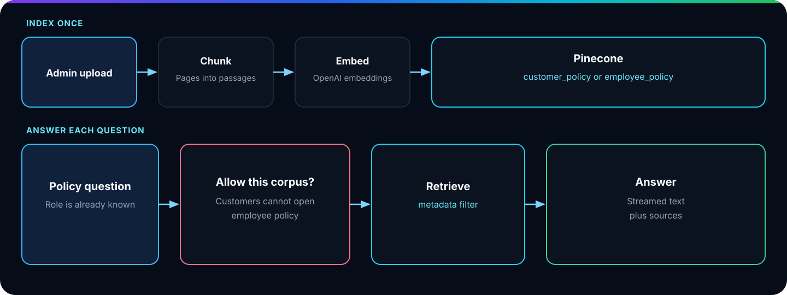</a>

Admins upload a PDF and mark it as customer policy or employee policy. The server extracts the text, splits it into overlapping chunks, embeds the chunks, and stores them in Pinecone with file, page, and document-type metadata.

At question time the policy agent:

1. Refuses employee policy when the user is not an employee.
2. Retrieves with a metadata filter for that document type.
3. Streams an answer grounded in those passages.
4. Returns the source file names with the reply.

If nothing relevant is indexed, the agent says so instead of answering from memory.

## ✅ Human-in-the-loop workflow

<a href="assets/diagrams/human-in-the-loop.svg" target="_blank" rel="noopener noreferrer">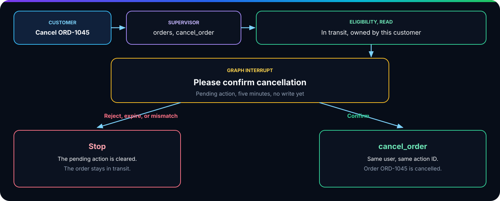</a>

Cancellation is the only write in this build.

1. The supervisor routes `cancel_order` and extracts the order ID.
2. The orders agent validates the arguments and checks eligibility.
3. A pending action is stored for five minutes.
4. The graph interrupts and the client shows an approval card.
5. **Confirm** runs `cancel_order` with that action ID.
6. **Reject**, expiry, or a mismatched action clears the pending action and writes nothing.

The same ownership and expiry checks run again at execution time.

## 📡 Real-time SSE streaming

The chat response is a stream, not a single JSON body. The interface updates as the graph works.

<table align="center" style="margin-left:auto;margin-right:auto">
  <tr>
    <th>Event</th>
    <th>What the user sees</th>
  </tr>
  <tr>
    <td><code>start</code></td>
    <td>Which agent and intent took the request</td>
  </tr>
  <tr>
    <td><code>delta</code></td>
    <td>Conversation or policy text as it is generated</td>
  </tr>
  <tr>
    <td><code>message</code></td>
    <td>A complete assistant message</td>
  </tr>
  <tr>
    <td><code>tool_result</code></td>
    <td>Structured order data</td>
  </tr>
  <tr>
    <td><code>sources</code></td>
    <td>Policy documents used in the answer</td>
  </tr>
  <tr>
    <td><code>confirmation_required</code></td>
    <td>The approval card</td>
  </tr>
  <tr>
    <td><code>done</code></td>
    <td>The terminal status</td>
  </tr>
</table>

## 📈 Observability with LangSmith

Tracing is aimed at the project `logistics-support-agent`. A reviewer can follow one user turn from the supervisor decision through the specialist and, when a tool is used, across the MCP boundary. MCP calls are traced at the client, so the tool name and outcome sit on the same run as the graph.

That is the practical test of the architecture: the route, the permission check, and the tool result are visible after the conversation ends.

## 🎯 Use cases

Demo customer **CUS-101** owns `ORD-1045` (in transit), `ORD-1046` (delivered), and `ORD-1047` (delayed).

<table align="center" style="margin-left:auto;margin-right:auto">
  <tr>
    <th>Who</th>
    <th>Request</th>
    <th>Route</th>
    <th>Component</th>
    <th>Result</th>
  </tr>
  <tr>
    <td>Customer</td>
    <td>“Where is order ORD-1045?”</td>
    <td>Orders · <code>order_status</code></td>
    <td>MCP <code>order_status</code></td>
    <td>Order ORD-1045 is currently in transit</td>
  </tr>
  <tr>
    <td>Customer</td>
    <td>“When will ORD-1047 arrive?”</td>
    <td>Orders · <code>delivery_estimate</code></td>
    <td>MCP <code>delivery_estimate</code></td>
    <td>Expected on 2026-08-30</td>
  </tr>
  <tr>
    <td>Customer</td>
    <td>“What are my orders?”</td>
    <td>Orders · <code>list_customer_orders</code></td>
    <td>MCP <code>list_customer_orders</code></td>
    <td>ORD-1045, ORD-1046, ORD-1047</td>
  </tr>
  <tr>
    <td>Customer</td>
    <td>“Can I cancel ORD-1045?”</td>
    <td>Orders · <code>cancel_order</code></td>
    <td>Eligibility, then human approval</td>
    <td>Approval card, no write yet</td>
  </tr>
  <tr>
    <td>Customer</td>
    <td>“Can I cancel ORD-1046?”</td>
    <td>Orders · <code>cancel_order</code></td>
    <td>Eligibility read</td>
    <td>Already delivered, no approval card</td>
  </tr>
  <tr>
    <td>Customer</td>
    <td>“What is your cancellation policy?”</td>
    <td>Policy · <code>customer_policy</code></td>
    <td>Customer-policy retrieval</td>
    <td>Grounded answer with sources</td>
  </tr>
  <tr>
    <td>Employee</td>
    <td>“What is the internal delayed-order escalation policy?”</td>
    <td>Policy · <code>employee_policy</code></td>
    <td>Employee-policy retrieval</td>
    <td>Internal answer with sources</td>
  </tr>
  <tr>
    <td>Customer</td>
    <td>Asks for that same employee policy</td>
    <td>Guardrail · <code>employee_policy</code></td>
    <td>Guardrail, no retrieval</td>
    <td>Not authorized</td>
  </tr>
</table>

### 📦 Where is ORD-1045?

<a href="assets/screenshots/scenario-status.png" target="_blank" rel="noopener noreferrer">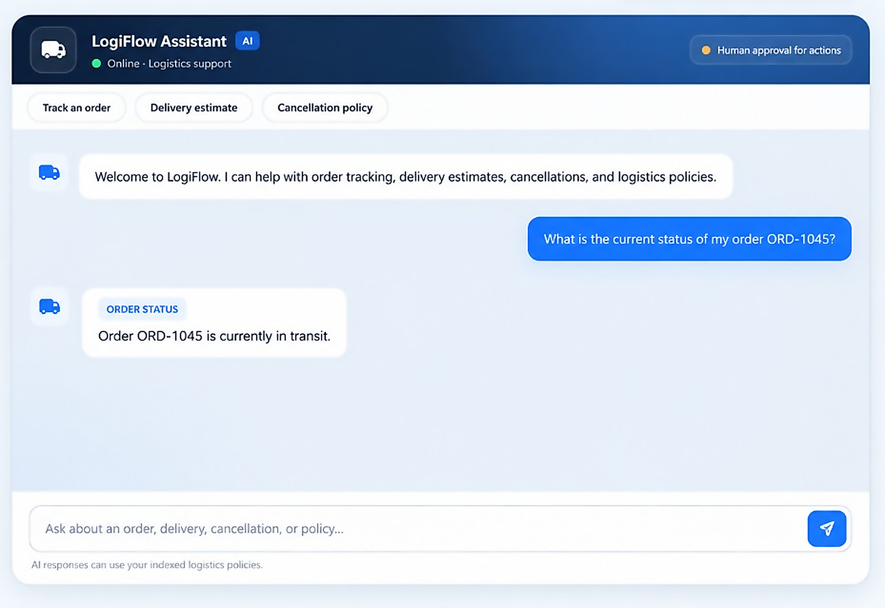</a>

Supervisor to orders to `order_status`. The reply is the live status, not a guess.

### 🚚 When will ORD-1047 arrive?

<a href="assets/screenshots/scenario-delivery.png" target="_blank" rel="noopener noreferrer">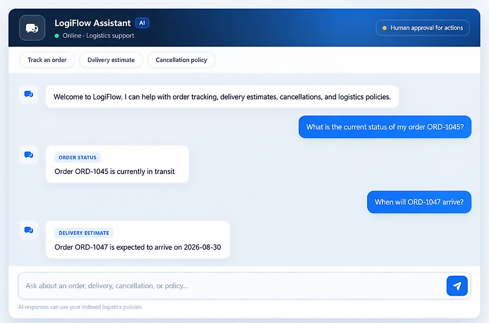</a>

Same agent, second read tool. The date comes from the order record.

### 📋 What are my orders?

<a href="assets/screenshots/scenario-orders.png" target="_blank" rel="noopener noreferrer">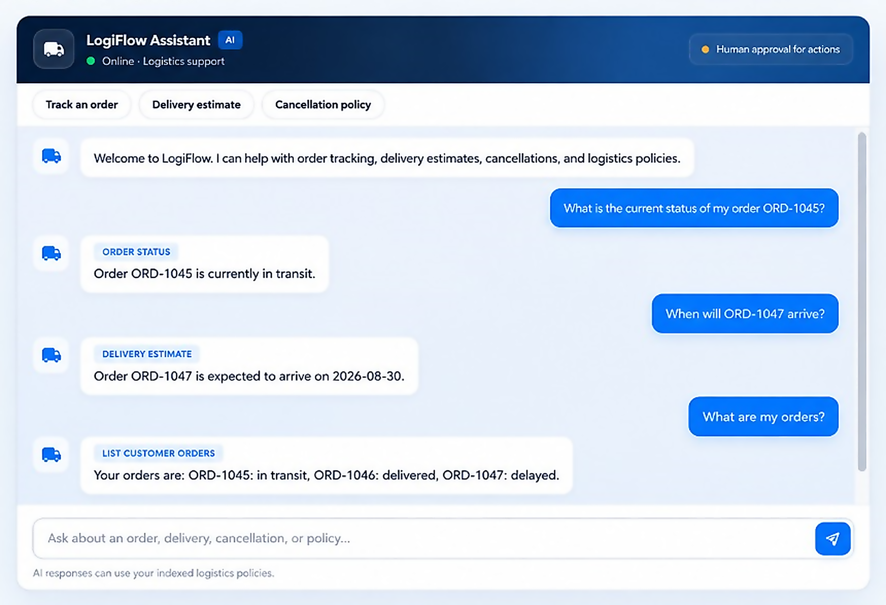</a>

No order ID in the message. The tool uses the signed-in customer and returns ORD-1045, ORD-1046, and ORD-1047.

### ✅ Can I cancel ORD-1045?

<a href="assets/screenshots/scenario-cancel.png" target="_blank" rel="noopener noreferrer">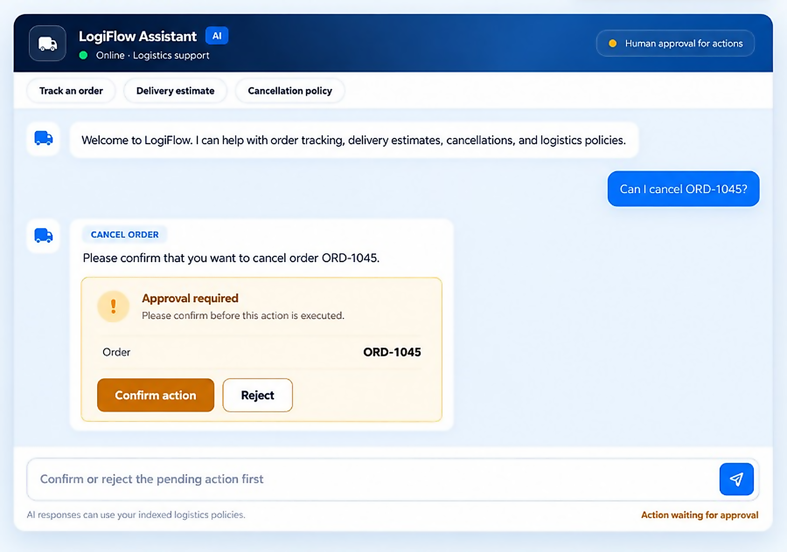</a>

The write has not run. Confirm is the only path that calls `cancel_order`.

### 🚫 Can I cancel ORD-1046?

<a href="assets/screenshots/scenario-ineligible.png" target="_blank" rel="noopener noreferrer">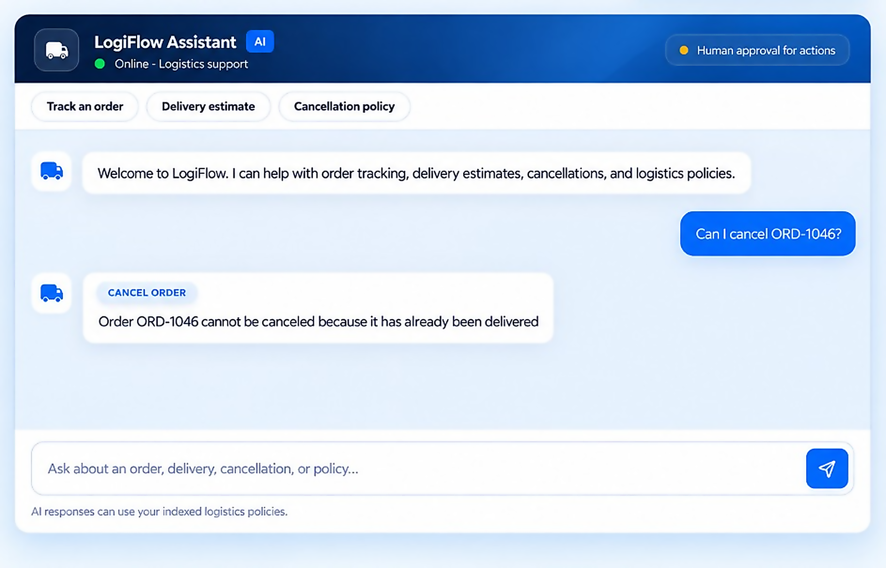</a>

Delivered orders stop at eligibility. The graph ends with no approval card and no write.

### 📄 What is the cancellation policy?

<a href="assets/screenshots/scenario-policy.png" target="_blank" rel="noopener noreferrer">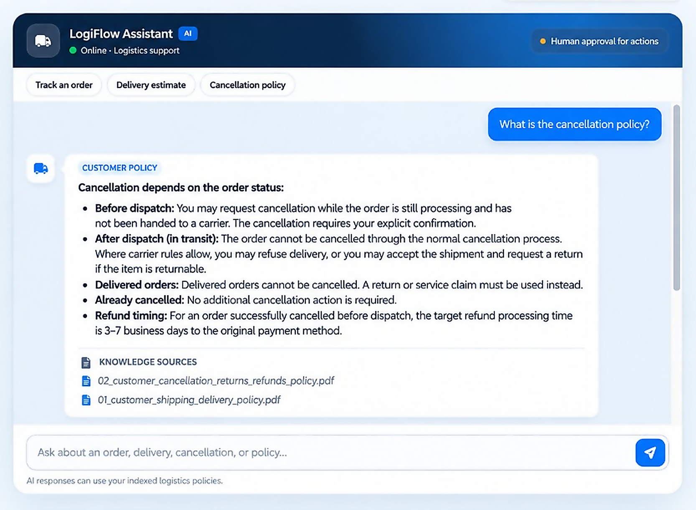</a>

No order tool. The client shows the answer and the source file. The wording follows the uploaded PDF.

### 🛡️ Customer asks for employee policy

<a href="assets/screenshots/scenario-guardrail.png" target="_blank" rel="noopener noreferrer">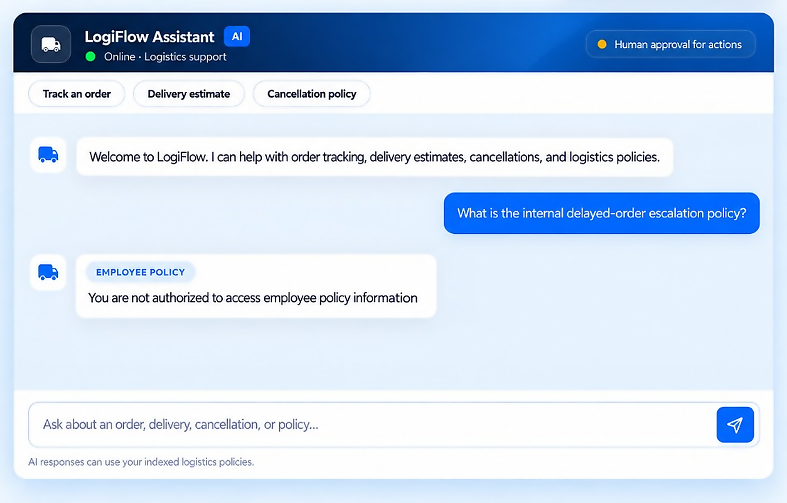</a>

The refusal is the exact guardrail message. No document search runs.

**Returns today.** A question such as “What is your returns policy?” is a policy request. The supervisor sends it to the Policy Agent, which answers from customer-policy documents.

**Returns as a future specialist.** “Is ORD-1045 eligible for a return?” is an operational decision, not a document lookup. The same supervisor pattern would route it to a Returns Resolution Agent, which would call an external returns service through MCP. That agent is not in this build. The orders agent is the working example of that pattern.

## 🧰 Technology stack

<table align="center" style="margin-left:auto;margin-right:auto">
  <tr>
    <th>Layer</th>
    <th>Choice</th>
  </tr>
  <tr>
    <td>🧭 Orchestration</td>
    <td>LangGraph, with a compiled orders subgraph</td>
  </tr>
  <tr>
    <td>🧠 Models</td>
    <td>OpenAI chat and <code>text-embedding-3-small</code></td>
  </tr>
  <tr>
    <td>📚 Retrieval</td>
    <td>PDF ingest, chunking, Pinecone</td>
  </tr>
  <tr>
    <td>🔧 Tools</td>
    <td>Model Context Protocol, streamable HTTP</td>
  </tr>
  <tr>
    <td>⚡ API</td>
    <td>Node.js, Express, server-sent events</td>
  </tr>
  <tr>
    <td>💬 Client</td>
    <td>React, Vite</td>
  </tr>
  <tr>
    <td>📈 Observability</td>
    <td>LangSmith</td>
  </tr>
  <tr>
    <td>🔐 Access in the demo</td>
    <td>Role-aware users: customer, employee, admin</td>
  </tr>
</table>
